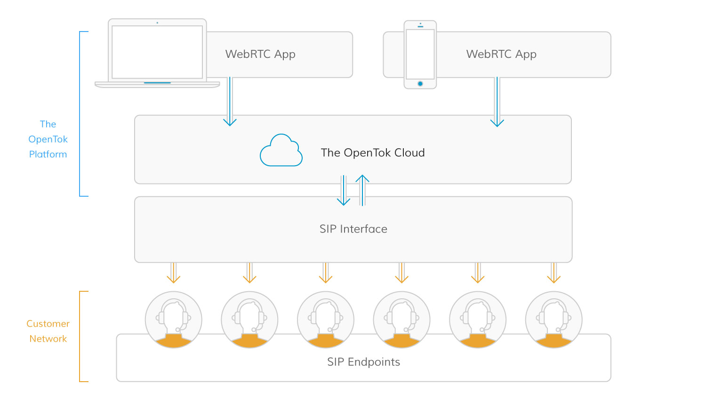

# OpenTok SIP Interconnect Sample App for JavaScript<br/>Version 1.0

This document describes how to use the OpenTok SIP Interconnect Sample App for JavaScript. Through the exploration of this sample application, you will learn best practices for adding audio from a SIP call directly into your website and mobile applications. 

The standard way to connect to the OpenTok platform is with the OpenTok client SDKs that use proprietary signaling interfaces provided by TokBox. However, it is sometimes useful to interconnect with other RTC platforms such as PSTN, IMS, PBX, and Call Centers. For such cases, TokBox exposes a SIP interface that enables access to existing 3rd party PSTN functionality. This interface enables users, who are connected via such 3rd party PSTN platforms, to participate in the audio portion of an OpenTok session.

_OpenTok SIP Interconnect provides support to dial out from an OpenTok session to any SIP URI._ For example, your OpenTok SIP Interconnect application would make a SIP call to a customer contact center, which routes the call to an agent. The agent accepts the phone call and participates by voice in the session in order to speak with the customer. In addition, the agent could still optionally join with video via a laptop. To make such functionality available, the OpenTok cloud infrastructure includes signaling and media gateways, as well as REST APIs, to allow you to trigger the SIP calls from OpenTok sessions as needed for your business logic.

The OpenTok SIP Interconnect Sample App allows you to start and end SIP calls, and its UI displays the participants using both WebRTC streams and SIP streams. WebRTC participants include video, while SIP participants are displayed with audio only.

You can configure and run this sample app within just a few minutes!

_**NOTE**: OpenTok SIP Interconnect supports only audio through the SIP interface, and does not currently support video. All the existing functionality of OpenTok, such as multiparty sessions and archiving, are compatible with OpenTok SIP Interconnect. OpenTok SIP Interconnect does not include any built-in PSTN functionality._


This guide has the following sections:

* [Architecture](#architecture): This section describes how the OpenTok SIP Interconnect solution works with gateways for third party SIP platforms.
* [Prerequisites](#prerequisites): A checklist of everything you need to get started.
* [Quick start](#quick-start): A step-by-step tutorial to help you quickly run the sample app.
* [Exploring the code](#exploring-the-code): This describes the sample app code design, which uses recommended best practices to implement the OpenTok SIP Interconnect app features. 


## Architecture

The OpenTok SIP Interconnect Gateway exposes a SIP Interface and REST APIs that trigger and customize the calls via third-party SIP platforms. The OpenTok SIP Interconnect Gateway is composed of two parts: the SIP Interface and the OpenTok Interface:



This architecture enables a SIP participant to appear in an OpenTok session like any other client. All that is required to enable this behavior is to pass an OpenTok **Session ID** and **Token** when initiating the SIP call the makes use of the OpenTok Dial REST API.

OpenTok identifies a SIP Gateway in the same region of the Media Server where the session is allocated. You can use the existing OpenTok capabilities if the default Media Server allocation is not ideal for your use (making use of the location hint when creating the session).
The SIP Gateway terminates the SIP Dialogs and RTP flows. The protocols and capabilities supported in both interfaces are described in the next sections.

The SIP Gateway is comprised of a session border controller (SBC), a Signaling Gateway, and a Media Mixer. The SBC component handles security as well as the protocol and codec adaptation. The Signaling Gateway converts the SIP primitives into the corresponding OpenTok primitives. The Media Mixer mixes the audio flows from multiple participants in OpenTok session in order to forward them as a single composite audio flow.

_**NOTE**: If media inactivity lasts for more than 5 minutes, the call will be automatically closed unless session timers are used at the SIP level. As a security measure, any SIP call longer than 6 hours will be automatically closed by OpenTok._


### Security considerations

There are some best practices recommended by TokBox when using this new SIP Interface with
your SIP Servers. They try to mitigate the possible attacks by providing the mechanisms to
authenticate and authorize that the SIP calls received in your server are legitimate and to
encrypt all the signaling and media:

* Use TLS and enable secure calls (SRTP) for signaling to avoid the possibility of
  intercepting the communications.

* Enable SIP authentication on your server. Otherwise, anyone who knows your SIP URI could
  send calls to your server.

If required, you can also block the traffic not coming from the IP addresses of the OpenTok
SIP gateway, which uses the following IP blocks:

* 52.200.60.16 &ndash; 52.200.60.31
* 52.41.63.240 &ndash; 52.41.63.255
* 52.51.63.16 &ndash; 52.51.63.31

Be aware that TokBox can add new IP blocks in the future, and you
will need to change your configuration.

### Technical details

**RFC3550 (RTP/RTCP) support:** Media traffic can be encrypted (SRTP) or non-­encrypted
(plain RTP). In case of encryption, both DTLS and SDES protocols are supported.

**Codec support:** The OpenTok SIP gateway supports the OPUS, G.711, and G.722 audio codecs.

**Signaling:** The OpenTok SIP gateway supports RFC3561 (SIP) over UDP, TCP, and TLS.
Contact TokBox if you need information or support for any specific extension.

The OpenTok SIP gateway will not accept any SIP message coming from the a third-party SIP
platform unless it is part of a SIP dialog initiated by the OpenTok SIP gateway.
Calls initiated with the OpenTok SIP gateway can be put on ­hold using either a `re-­INVITE`
with the `sendonly/inactive` direction in the SDP or a `re-­INVITE` with port 0 in the SDP.

**Other considerations:** Early media is disabled, and DTMFs are not currently supported.


### Additional Information

For additional information see [SIP Interconnect](https://www.tokbox.com/developer/guides/sip/) at the TokBox Developer Center. 


## Prerequisites

To be prepared to develop your OpenTok SIP Interconnect app:

1. Review the [OpenTok.js](https://tokbox.com/developer/sdks/js/) requirements.
2. Your app will need **Token** and **API Key**, which you can get at the [OpenTok Developer Dashboard](https://dashboard.tokbox.com/). Set the API Key and API Secret in [config.js](./config.js).


To install the OpenTok SIP Interconnect Sample App, run the following commands:

```
npm install
node bin/www
```


_**IMPORTANT:** In order to deploy an OpenTok SPI Interconnect app, your web domain must use HTTPS._


## Quick start

The web page that loads the sample app for JavaScript must be served over HTTP/HTTPS. Browser security limitations prevent you from publishing video using a `file://` path, as discussed in the OpenTok.js [Release Notes](https://www.tokbox.com/developer/sdks/js/release-notes.html#knownIssues). To support clients running [Chrome 47 or later](https://groups.google.com/forum/#!topic/discuss-webrtc/sq5CVmY69sc), HTTPS is required. A web server such as [MAMP](https://www.mamp.info/) or [XAMPP](https://www.apachefriends.org/index.html) will work, or you can use a cloud service such as [Heroku](https://www.heroku.com/) to host the application.


## Exploring the code

This section describes how the sample app code design uses recommended best practices to deploy the SIP Interconnect features. 

For detail about the APIs used to develop this sample, see the [OpenTok.js Reference](https://tokbox.com/developer/sdks/js/reference/).

  - [Web page design](#web-page-design)
  - [SIP Call](#sip-call)


_**NOTE:** The sample app contains logic used for logging. This is used to submit anonymous usage data for internal TokBox purposes only. We request that you do not modify or remove any logging code in your use of this sample application._

### Web page design

While TokBox hosts [OpenTok.js](https://tokbox.com/developer/sdks/js/), you must host the sample app yourself. This allows you to customize the app as desired. For details about the one-to-one communication audio-video aspects of the design, see the [OpenTok One-to-One Communication Sample App](https://github.com/opentok/one-to-one-sample-apps/tree/master/one-to-one-sample-app/js) and [OpenTok Common Accelerator Session Pack](https://github.com/opentok/acc-pack-common/).

* **[index.ejs](./views/index.ejs)**: This defines the container defining the publisher and layout for the sample app, including the buttons to start and end the SIP call. This file contains the business logic that initiates the OpenTok session and handles the SIP call click events.

* **[config.js](./config.js)**: Configures the participant’s **Session ID**, **Token**, and **API Key** used to create the OpenTok session in [index.js](./routes/index.js), and specifies the SIP headers and credentials required to start the SIP call.

* **[index.js](./routes/index.js)**: Creates the OpenTok session and builds the POST request for starting the SIP call using the credentials specified in [config.js](./config.js).

* **[CSS files](./public/stylesheets)**: Defines the client UI style. 


### SIP Call

A SIP call is made by clicking the **Start SIP Call** button, which results in a REST POST request of this form:

```
http://api.opentok.com/v2/project/API_KEY/call
```

where `API_KEY` is the participant’s **API Key**, which is used to create the OpenTok session.


The `router.post()` method in [index.js](./routes/index.js) creates such a POST request to start the SIP call. Its `json` field specifies:

  - Participant OpenTok credentials
  - SIP credentials
  - A `secure` field indicating whether TLS encryption is applied
  - SIP headers to be added to the SIP INVITE request

In this sample application, a SIP token is defined as part of the metadata, which may be be useful for embedding UI metadata for the audio participant. The token is generated as part of the token metadata (`data: "sip=true"`, which is stored in `event.stream.connection.data`) as the OpenTok session is created:

```javascript
opentok.createSession({ mediaMode:"routed" }, function(error, session) {
  if (error) {
    console.log("Error creating session:", error);
    res.status(500).send("Error creating session.");
  } else {
    sessionId = session.sessionId;

    //  Use the moderator role so you can force disconnect the SIP call
    // Generate a token.
    webrtcToken = opentok.generateToken(sessionId, {role: "moderator"});
    sipToken = opentok.generateToken(sessionId, {data: "sip=true"});
  }
});
```

**NOTE:** Such metadata is not actually necessary to start a SIP call, though it has advantages as shown in this sample app. It is also possible to simply call `opentok.dial(sessionID, token, sipUri)` to start the SIP call.<br/><br/> 


The `streamCreated` listener, as shown here in [index.ejs](./views/index.ejs), inspects this token metadata to determine if the new participant is joining via a SIP call:

```javascript
var session = OT.initSession(sessionId);
session.on("streamCreated", function (event) {
  var tokenData = event.stream.connection.data;
    if (tokenData && tokenData.includes("sip=true")) {
      var element = "sipPublisherContainer";
    } else {
      var element = "webrtcPublisherContainer";
     }

  . . .

}
```


Once the session has been established and the SIP token (`sipToken`) has been generated, the REST POST request passes that information to the SIP call endpoint:


```javascript
router.post('/sip/start', function(req, res, next) {
  console.log('received sip start call');
  var sessionId = req.body.sessionId;
  var apiKey = req.body.apiKey;

  var options = {
    uri: 'http://api.opentok.com/v2/project/' + apiKey + '/dial',
    method: 'POST',
    json: {
      sessionId: sessionId,
      token: sipToken,
      sip: {
        uri: config.sipUri
      },
      auth: {
        username: config.sipUsername,
        password: config.sipPassword
      },
      secure: true
    },
    headers: {
      'X-TB-PARTNER-AUTH': apiKey + ':' + config.apiSecret
    }
  };

  // Pass in headers if specified
  if (config.sipHeaders && Object.keys(config.sipHeaders).length !== 0) {
    options.sip.headers = config.sipHeaders;
  }

  request(options, function (error, response, body) {
    if (!error && response.statusCode === 200) {
      console.log('Successfully started SIP call!');
      res.send(body);
    } else {
      console.log('Failure to start SIP call!');
      console.log(response);
      res.status(response.statusCode).send(body);
    }
  });
});
```

